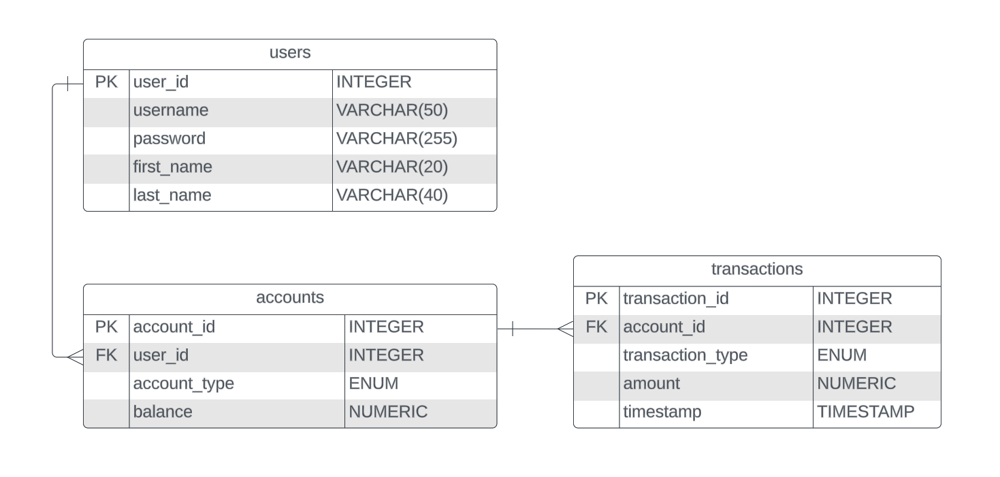

## Banking Application Details

### User Stories

-   [ ] register a new user account with the system (must be secured with a password)
-   [ ] login with my existing credentials
-   [ ] create at least one account
-   [ ] deposit funds into an account (use doubles, not ints)
-   [ ] withdraw funds from an account (no overdrafting!)
-   [ ] view the balance of my account(s) (all balance displays must be in proper currency format)
-   [ ] create multiple accounts per user (checking, savings, etc.)

### ER Diagram

